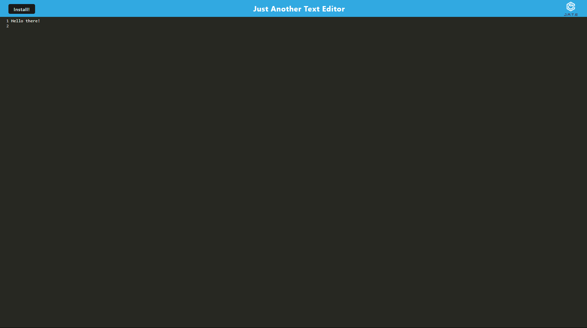

# Just Another Text Editor

This is an example progressive web application that functions as a simple text editor.  It is designed to function either in the browser or as a standalone offline application if downloaded.

Built with [Webpack](https://webpack.js.org/), [Workbox](https://developer.chrome.com/docs/workbox/), [Express.js](https://expressjs.com/), [Babel](https://babeljs.io/), and [idb](https://www.npmjs.com/package/idb).